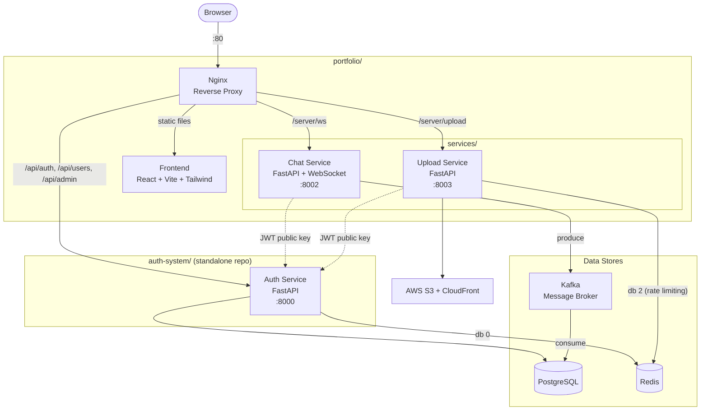

# Portfolio

**adding kafka message broker to handle writing users messages to the database**

### design

first let's take a look at how the current system is designed:

1) entry point is core loop, we listen for incoming messages extract the msg_type -------> then forward to request_filter(data, msg_type, user_id, user_email, websocket)
2) in request_filter we have 4 scenarios:
    msg_type == "message" # --> {"type":"message", "to":to, "message":message}
    msg_type == "file_upload" # --> {"type":"upload_file", "to":"to_id", "url":"url"}
    msg_type == "load_history"# --> {"type":"load_history", "dm_key":dm_key, "before": int or none}
    if it's none then it's a friend request

for this feature we will only be working with two msg_types, message and file_upload

3) if msg_type == "message" or "file_upload" ---> forward to ----> chat_handler

    chat_handler's logic is mostly calling repo layer functions, first we query chats table to see if this is a new chat or an existing one:
    * new chat: generate unique chat_id ----> construct Chat ORM ---> construct 2 ChatMember ORMs ---> insert ORMs to db 
                ----> construct message ORM --> insert ORM to db --> return to manager.send_personal_message() in chat_websocket

    * existing chat: construct message ORM --> insert ORM to db --> return to manager.send_personal_message() in chat_websocket

* where should the broker be plugged?

- broker should be put between websocket and service layer, so instead of:
1) core loop ---> request_filter ---> chat_service.chat_handler() ---> repo layer ---> insert to db
    ----> request_filter ---> send_personal_message

we will have:
- existing chat path:
    core loop -> request_filter -> producer.produce(message) -> send_personal_message()
                                            ↓
                                            topic
                                            ↓
                                            consumer → repo layer → DB
- new chat:
    core loop -> request_filter -> chat_service.create_chat_if_needed() (sync)
                                -> producer.produce(message)
                                -> send_personal_message()

* broker:
1 broker, 2 topics (chat-topic, dead-letter topic), 3 partitions by chat_id

* files:
producer.py
consumer.py # runs as its own process
broker_setup.py # config script runs on startup

* failure strategies:
- producer: if the producer can't reach the broker, messages get delivered in real-time but never inserted to db
    - solution: fallback to direct DB write if produce fails

- consumer: 
    - Retry with backoff for transient DB errors (connection timeout, deadlock)
    - Dead-letter topic after N retries for poison messages (bad data, constraint violations)
    - Don't skip silently to not lose messages and never know